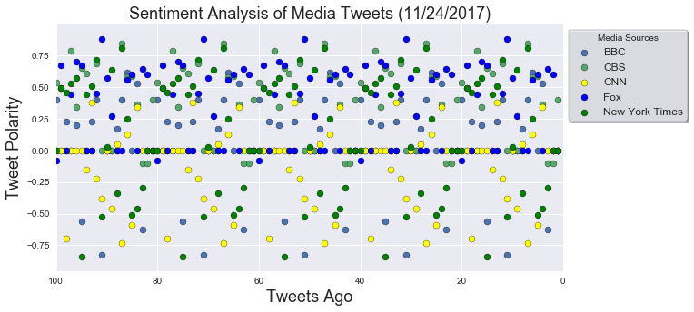
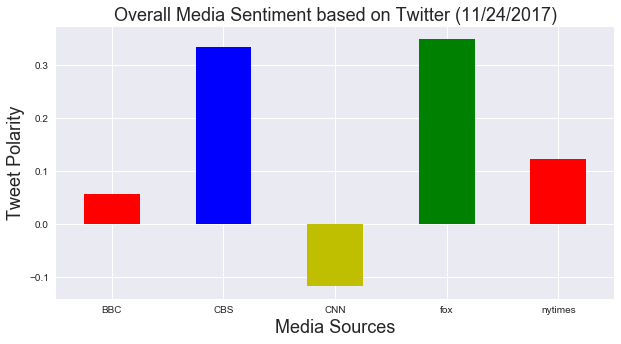
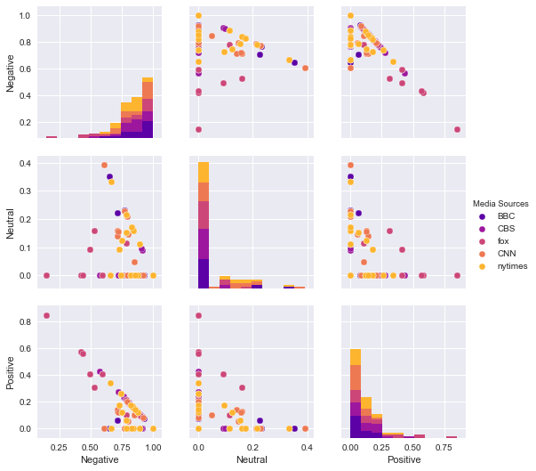

<h1>Distinguishing Sentiments</h1>

<h2> Table of contents</h2>
1. Introduction
2. Import libraries
3. Setup Tweepy API Authentication
4. Use Twitter API to obtain tweets for Media Sources
5. Generated dataframe containing sentiment for Media Sources
6. Save df_sentiment_analysis as a csv titled, 'Sentiment_analyzer_Twitter.csv'
7. Generated dataframes for all media sources
8. Plot of Sentiment Analysis for Media Tweets
9. Generated Overall Media Sentiment based on Twitter table
10. Plot of Overall Media Sentiment Analysis
11. Generated average sentiment scores dataframe
12. Relationship Plot for Polarity Scores
13. Conclusion

<h3><u>Instructions</u></h3>
In this assignment, the goal is to create a Python script to perform a sentiment analysis of the Twitter activity of various news outlets and to present your findings visually.

<h3><u>libraries used</u></h3>

tweepy
numpy
pandas 
datetime
matplotlib
import seaborn as sns
vaderSentiment.vaderSentiment 

<h3><u>Plot of Sentiment Analysis for Media Tweets</u></h3>

Plot of Overall Media Sentiment Analysis

Relationship Plot for Polarity Scores</u></h3>

<h3><u>Conclusion</u></h3>

While performing a sentiment analysis for Tweets from various news outlets, I noticed a few different insights. The insights are below:

<h4><u>Insights</u></h4>
<ul>
<li>In the Correlation Plot for Polarity Scores, there is a correlation between positive and negative polarities. As the positivity decreased the negative polarities increased for each media source. </li> 

<li>In the Overall Media Sentiment Analysis Plot, CNN appears to have more negative compound tweets.
 </li> 
<li>BBC has the highest positive polarity scores when compared to all other media sources.</li>
</ul>

